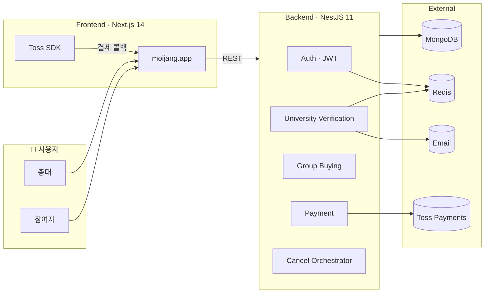

<div align="center">

# 🛒 Moijang

### 같이 모으면, 더 싸게 산다

**대학생을 위한 캠퍼스 공동구매 플랫폼**

모집 · 결제 · 환불 · 수령까지 한곳에서 이어지는 공구 경험

<br />

[](https://moijang.app)
[](https://api.moijang.app/api-docs)

<br />

[](https://nodejs.org/)
[](https://nestjs.com/)
[](https://nextjs.org/)
[](https://www.mongodb.com/)
[](https://www.typescriptlang.org/)
[](https://www.tosspayments.com/)

</div>

---

## ✨ Moijang이란?

**Moijang(모이장)** 은 대학생이 **같은 학교·같은 캠퍼스**에서 물건을 함께 모아 살 수 있도록 돕는 **공동구매 플랫폼**입니다.

|     | 핵심 기능                                       |
| :-: | :---------------------------------------------- |
| 🎓  | **대학 이메일 인증**으로 재학생만 가입 · 로그인 |
| 💳  | **토스페이먼츠** 카드 결제로 참여 즉시 확정     |
| 🔄  | 참여 취소 · 공구 무산 시 **자동 환불**          |
| 🔔  | 공구 상태 변경 **웹 푸시** 알림                 |

총대는 공구를 열고 모집·주문·배송을 관리하고, 팀원은 결제 한 번으로 참여합니다. 더 이상 “입금했어요” 버튼과 계좌 확인 스크린샷에 의존하지 않아도 됩니다.

<br />

<table>
<tr>
<td width="50%" valign="top">

### 👑 총대 (리더)

- 공구 개설 · 수정
- 모집 현황 · 참여자 목록
- 주문 / 배송 / 완료 상태 관리
- 공구 취소 시 **전원 일괄 환불**

</td>
<td width="50%" valign="top">

### 🙋 참여자 (팀원)

- **토스 PG**로 즉시 결제 참여
- 모집 중 **개인 환불** 및 참여 취소
- 내가 참여한 / 개설한 공구 목록
- 실시간 알림 수신

</td>
</tr>
</table>

---

## 🌐 서비스 URL (Production)

| 구분                   | URL                                                                  |
| ---------------------- | -------------------------------------------------------------------- |
| **웹 서비스**          | [https://moijang.app](https://moijang.app)                           |
| **REST API**           | [https://api.moijang.app/api](https://api.moijang.app/api)           |
| **API 문서 (Swagger)** | [https://api.moijang.app/api-docs](https://api.moijang.app/api-docs) |

> 로컬 개발 시에는 아래 [시작하기](#-시작하기-local-development) 섹션을 참고하세요.

---

## 🎯 주요 기능

### 🎓 대학생 인증 로그인

- 가입 시 **소속 대학 선택** + **학교 이메일(@학교 도메인)** 인증
- 6자리 인증 코드 발송 · 확인 후 회원가입 토큰 발급
- 로그인 후 **JWT** 기반 세션 (HttpOnly Cookie)
- 동일 대학 도메인이 아니면 가입 불가 — 캠퍼스 단위 신뢰 확보

### 💳 토스페이먼츠 결제

```
checkout → 토스 결제창 → confirm → 참여 확정
```

- 결제 승인 시점에만 `Participant` 생성 (결제 없는 참여 차단)
- 참여 취소: `POST /payment/refund` — **`gbId`만 전달**, 서버가 본인 결제 조회 후 환불
- 총대 공구 취소: 오케스트레이터가 **PAID 건 일괄 환불** (`allSuccess` / `partialSuccess` / `failed`)

### 📦 공구 생명주기

| 상태         | 설명                               |
| ------------ | ---------------------------------- |
| `RECRUITING` | 모집 중 · PG 참여 · 개인 환불 가능 |
| `CONFIRMED`  | 정원 충족 · 모집 완료              |
| `ORDERED`    | 총대 주문 진행                     |
| `SHIPPED`    | 배송 · 수령 안내                   |
| `COMPLETED`  | 공구 종료                          |
| `CANCELLED`  | 공구 취소 · 환불 처리              |

### 🔔 그 외

- **웹 푸시** — 공구 상태·참여 관련 알림
- **대학·학과** 메타데이터 기반 온보딩
- **Swagger** — API 스펙 공개

---

## 🏗 시스템 구조



---

## 📁 프로젝트 구조

```
Moijang/
├── frontend/                 # Next.js 14 · App Router
│   └── src/
│       ├── app/              # (home) · (auth) · (protected)
│       ├── apis/             # API 클라이언트
│       └── components/
├── backend/                  # NestJS 11
│   └── src/
│       ├── auth/
│       ├── university-verification/
│       ├── group-buying/
│       ├── payment/          # 토스 PG
│       ├── participant/
│       ├── cancel-orchestrator/
│       ├── web-push/
│       └── docs/             # 결제·아키텍처 설계 문서
├── docs/migration-guide/
└── package.json              # npm workspaces
```

---

## 🛠 기술 스택

| 영역         | 기술                                                                                            |
| ------------ | ----------------------------------------------------------------------------------------------- |
| **Frontend** | Next.js 14 · React 18 · TypeScript · MUI · Mantine · Tailwind · Zustand · React Hook Form · Zod |
| **Backend**  | NestJS 11 · Mongoose · Passport JWT · Swagger · class-validator                                 |
| **결제**     | [토스페이먼츠](https://docs.tosspayments.com/) Payment Gateway                                  |
| **인증**     | 학교 이메일 OTP · Redis 세션 · JWT                                                              |
| **데이터**   | MongoDB · Redis                                                                                 |
| **알림**     | Web Push (VAPID) · Nodemailer                                                                   |
| **품질**     | ESLint · Prettier · Husky · lint-staged                                                         |

---

## 🚀 시작하기 (Local Development)

### 사전 요구사항

- Node.js **20+** · npm **9+**
- MongoDB · Redis
- 토스페이먼츠 **테스트 키** ([개발자센터](https://developers.tosspayments.com/))
- Gmail SMTP (학교 이메일 인증 코드 발송용)

### 설치 & 실행

```bash
git clone https://github.com/your-org/Moijang.git
cd Moijang
npm install

# Terminal 1 — API (http://localhost:3001)
npm run start:dev -w backend

# Terminal 2 — Web (http://localhost:3000)
npm run dev -w frontend
```

| 서비스     | 로컬 URL                       |
| ---------- | ------------------------------ |
| 프론트엔드 | http://localhost:3000          |
| API        | http://localhost:3001/api      |
| Swagger    | http://localhost:3001/api-docs |

### 환경 변수

<details>
<summary><b>Backend</b> — <code>backend/.env.development</code></summary>

```env
PORT=3001
MONGO_URI=mongodb://localhost:27017/moijang
REDIS_URL=redis://127.0.0.1:6379

JWT_SECRET=your-jwt-secret

TOSS_CLIENT_KEY=test_ck_...
TOSS_SECRET_KEY=test_sk_...

FRONT_URL=http://localhost:3000

MAIL_USER=
MAIL_PASS=

VAPID_PUBLIC_KEY=
VAPID_PRIVATE_KEY=
```

</details>

<details>
<summary><b>Frontend</b> — <code>frontend/.env.local</code></summary>

```env
NEXT_PUBLIC_API_BASE_URL=http://localhost:3001
NEXT_PUBLIC_VAPID_PUBLIC_KEY=
```

</details>

### 코드 품질

```bash
npm run lint      # 전체 린트
npm run format    # Prettier
```

---

## 📡 주요 API

| Method  | Path                                   | 설명                                      |
| ------- | -------------------------------------- | ----------------------------------------- |
| `POST`  | `/api/verification/send-code`          | 학교 이메일 인증 코드 발송                |
| `POST`  | `/api/verification/confirm-code`       | 인증 확인 · 회원가입 토큰                 |
| `POST`  | `/api/auth/signup` · `/api/auth/login` | 회원가입 · 로그인                         |
| `POST`  | `/api/payment/checkout`                | 결제 시작                                 |
| `POST`  | `/api/payment/confirm`                 | 결제 승인 · 참여 확정                     |
| `POST`  | `/api/payment/refund`                  | 참여 취소 · 환불 (`gbId`, `cancelReason`) |
| `PATCH` | `/api/group-buying/cancel/:gbId`       | 총대 공구 취소 · 일괄 환불                |
| `GET`   | `/api/group-buying/:gbId`              | 공구 상세                                 |

전체 스펙은 **Swagger** [`/api-docs`](https://api.moijang.app/api-docs) 에서 확인할 수 있습니다.

---

## 📚 문서

| 문서                                                                               | 내용                              |
| ---------------------------------------------------------------------------------- | --------------------------------- |
| [backend/docs/payment/](backend/docs/payment/)                                     | PG 결제 아키텍처 · 오케스트레이션 |
| [backend/docs/circular-dependency/](backend/docs/circular-dependency/)             | NestJS 모듈 순환 참조 해소        |
| [docs/migration-guide/issue-8-payment.md](docs/migration-guide/issue-8-payment.md) | 프론트 결제 마이그레이션 가이드   |

---

## 🤝 기여

1. 이슈 또는 작업 범위를 확인합니다.
2. 기능 브랜치를 생성해 작업합니다.
3. `npm run lint` 로 검증합니다.
4. [PR 템플릿](.github/pull_request_template.md)에 맞춰 설명을 작성합니다.

---

<div align="center">

<br />

### 🎓 캠퍼스에서 만나는 가장 편한 공구, Moijang

[서비스 바로가기](https://moijang.app) · [API 문서](https://api.moijang.app/api-docs)

<br />

<sub>PMI 공동구매 플랫폼 · NestJS & Next.js</sub>

</div>
