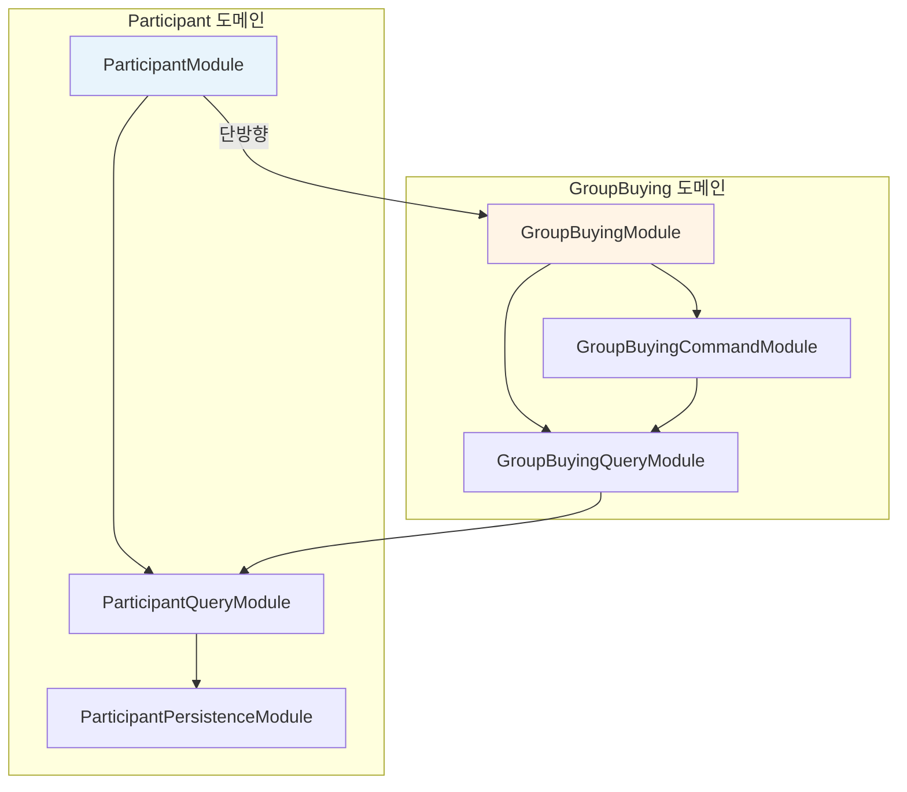
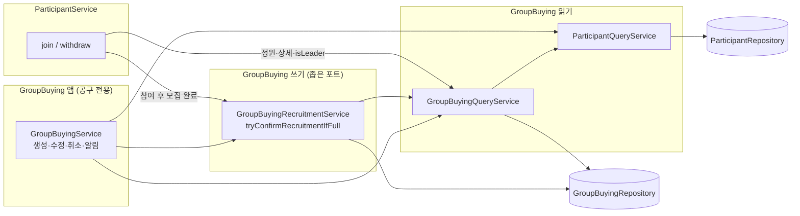

# 01. NestJS 모듈 순환 참조 해소 — GroupBuying · Participant · Payment

`GroupBuyingModule` ↔ `ParticipantModule` 순환 참조를 예방·해소하고, `Payment` 확장 시 삼각 순환을 막기 위한 **구조·작업 순서** 기준 문서다.

**문서 구성 (역할 분담)** — [목차 README](./README.md)

| 문서                                                                                 | 역할                                                                             |
| ------------------------------------------------------------------------------------ | -------------------------------------------------------------------------------- |
| **본 문서 (01)**                                                                     | 문제·원인, 해결 전략, 모듈 의존 그래프, 통합 체크리스트, join CONFIRMED 의사결정 |
| [02-공구-Query-레이어-설계.md](./02-공구-Query-레이어-설계.md)                       | Query 레이어 설계 원칙, 메서드·aggregate, Query 전용 고민·리스크                 |
| [03-총대-수량-leaderCount-정책과-구현.md](./03-총대-수량-leaderCount-정책과-구현.md) | `leaderCount` 1·2·3안 비교, 3안 구현·마이그레이션·수동 테스트                    |

**구현 현황 스냅샷:** 2026-05-19 (코드 기준)  
핵심 순환 참조(`forwardRef`, 서비스 상호 주입)는 **해소됨**. Payment·이벤트·`getCapacitySnapshot` 등 **후속 작업**은 §4 체크리스트 참고.

---

## 1. 문제 상황

> §1-1은 **리팩토링 전(당시)** 기록이다. 현재 구조는 §3·§4를 본다.

### 1-1. 당시 발생 중이던 순환 참조 (Before)

- `GroupBuyingModule` ↔ `ParticipantModule`이 서로 `forwardRef`로 연결되어 있다.
- `GroupBuyingService`는 `ParticipantService`에 직접 의존한다.
- `ParticipantService`는 `GroupBuyingRepository`에 직접 의존한다.
- `ParticipantRepository`는 `Participant` 외에 `GroupBuying` 모델까지 주입받아 도메인 경계가 섞여 있다.

당시에는 "동작은 하지만 구조 부채가 누적되는 상태"였고, 테스트/리팩토링 난도가 높았다.

**근본 원인:** 모듈 import 자체보다 **Service/Repository 책임 혼합**(조회·쓰기·타 도메인 persistence)이 순환을 만든다.

### 1-2. 앞으로 커질 문제 (Payment 확장 시) — 여전히 유효

`Payment`가 완성되면 일반적으로 다음 의존이 필요해진다.

- 결제 시작 시 공구 상태/단가/정원 조회
- 결제 확정 시 참여자 생성/검증
- 취소/환불 후 상태 동기화

이때 `PaymentService`가 `GroupBuyingService`, `ParticipantService`를 직접 주입하면  
양방향 구조에 `Payment`가 추가되어 **삼각 순환 참조**로 확장될 가능성이 매우 높다.  
→ [Phase 5](#phase-5-payment-연동)는 아직 미착수.

`Payment`는 오케스트레이션 성격이 강해 전체 feature Service 주입 시 결합이 급증한다. Query/Repository **포트**로만 접근하는 것이 설계 근거다.

---

## 2. 해결 방안

### 2-1. 핵심 전략 (권장 순서)

1. **구조적 개선(조회/영속성 분리)**: 주 전략
2. **이벤트 기반 분리**: 후처리 디커플링
3. **`forwardRef` 최소화**: 임시 대응으로만 제한

즉, `forwardRef`를 늘려 버티지 않고, 의존 방향을 단방향으로 고정한다.

### 2-2. 타겟 의존 구조 (단일 기준)

**목표 그래프**

```text
ParticipantModule -> GroupBuyingQueryModule (이상형)
GroupBuyingModule -> GroupBuyingQueryModule -> ParticipantQueryModule
ParticipantQueryModule -> ParticipantPersistenceModule

PaymentModule -> GroupBuyingQueryModule (또는 GroupBuyingRepository 포트)
PaymentModule -> ParticipantCommandModule (또는 ParticipantRepository 포트)
PaymentModule -> PaymentPersistence (자체)
```

**현재 실제 모듈 그래프 (2026-05-19)**

```text
ParticipantPersistenceModule
        ↑
ParticipantQueryModule ─────────────────────────┐
        ↑                                       │
GroupBuyingQueryModule                          │
        ↑                                       │
GroupBuyingModule (Guard, Service, Command export) │
        ↑ exports: QueryModule, CommandModule      │
ParticipantModule ─────────────────────────────┘
  imports: ParticipantQueryModule, GroupBuyingModule
  ParticipantService: GroupBuyingQueryService(read), GroupBuyingRecruitmentService(write)
  (GroupBuyingModule → ParticipantModule 역import 없음 → 순환 없음)
```

**규칙**

| 규칙                                                     | 상태              |
| -------------------------------------------------------- | ----------------- |
| `GroupBuyingModule` → `ParticipantModule` 직접 의존 금지 | ✅                |
| `PaymentModule` → 타 도메인 **전체 Service** 주입 금지   | ⬜ Payment 미연동 |
| 알림/통계/비핵심 후처리는 이벤트 핸들러로 이동           | ⬜                |

### 2-3. 방식별 적용 기준

| 방식                           | 장점                          | 단점                             | 결론          |
| ------------------------------ | ----------------------------- | -------------------------------- | ------------- |
| `forwardRef`                   | 즉시 에러 회피                | 구조 문제 은닉                   | 응급처치만    |
| 조회/쓰기 분리 (Query/Command) | 근본 원인 제거, 테스트성 향상 | 모듈·파일 증가                   | **최우선**    |
| Shared/Core Module             | 공통 인프라 정리              | 도메인 순환 자동 해결 안 됨      | 보조          |
| 이벤트 기반                    | 결합도 감소                   | 동기 검증·핵심 플로우에는 부적합 | 후처리·알림용 |

Query 레이어 상세(메서드·aggregate·Query 간 결합): [02-공구-Query-레이어-설계.md](./02-공구-Query-레이어-설계.md)

### 2-4. 고민 지점 (포트폴리오용) — 모듈 의존 형태

**Q. `ParticipantModule`이 `GroupBuyingQueryModule`만 보면 되지 않나? 왜 `GroupBuyingModule`을 import하나?**

- `GroupBuyingAccessGuard`를 `GroupBuyingModule`에서 provider/export 하기 위함.
- `ParticipantService`는 `GroupBuyingQueryService`만 주입받지만, 모듈은 Guard·re-export 경로 때문에 feature 모듈을 끌어온다.
- **대안(미적용):** `GroupBuyingAccessModule`을 얇게 분리 → `ParticipantModule`은 Query + Access만 import. Guard와 WebPush·알림을 분리할 수 있음.
- **트레이드오프:** 파일 수 vs. feature 모듈 간 결합도. 순환은 없지만 “participant가 group-buying 패키지 전체에 기대는” 형태는 남음.

---

## 3. 판단 근거 — Before / After

| 항목                                           | Before                          | After (2026-05-19)                                                                   |
| ---------------------------------------------- | ------------------------------- | ------------------------------------------------------------------------------------ |
| `forwardRef`                                   | GB ↔ Participant                | **제거** (`backend/src` 0건)                                                         |
| `GroupBuyingService` → `ParticipantService`    | 직접                            | **제거** → `ParticipantQueryService`                                                 |
| `ParticipantService` → `GroupBuyingRepository` | 직접                            | **제거** → `GroupBuyingQueryService`                                                 |
| `ParticipantRepository`                        | GB 모델 혼재                    | Participant 전용                                                                     |
| 총대 수량                                      | `createLeader` / participant 행 | **3안** `leaderCount` on GB — [03번 문서](./03-총대-수량-leaderCount-정책과-구현.md) |
| Command                                        | —                               | `GroupBuyingRecruitmentService` (`tryConfirmRecruitmentIfFull`)                      |
| `currentCount` 수식                            | participants 합(총대 행 포함)   | `participantTotal + leaderCount` — Query 단일화                                      |
| join 후 CONFIRMED                              | 분산·주석                       | `GroupBuyingRecruitmentService` — [§5](#5-join-후-confirmed--의사결정-2026-05-19)    |
| Payment 연동                                   | —                               | **미착수**                                                                           |

---

## 4. 통합 작업 체크리스트

### Phase 1. Participant 영속/조회 분리

- [x] `participant-persistence.module.ts`
- [x] `participant-query.service.ts` · `participant-query.module.ts`
- [x] `participant.repository.ts` — `GroupBuying` 모델 제거
- [x] `ParticipantQueryModule`이 `ParticipantPersistenceModule` re-export

### Phase 2. GroupBuying 의존 방향 수정

- [x] `group-buying.module.ts` — `forwardRef` 제거
- [x] `group-buying.service.ts` — 조회 `ParticipantQueryService`
- [x] `participant.module.ts` — `forwardRef` 제거
- [x] `ParticipantService` — `GroupBuyingRepository` 제거 → `GroupBuyingQueryService`

### Phase 3. GroupBuying Query 레이어

- [x] `group-buying-query.module.ts` · `group-buying-query.service.ts`
- [x] Controller 목록/상세 → Query 이관
- [x] `getEffectiveCurrentCount`, `participantCountLookupStages()`
- [ ] `getCapacitySnapshot` (선택) — [02번 문서 §4](./02-공구-Query-레이어-설계.md#4-query-메서드-우선순위-vs-구현)
- [x] `group-buying.repository.ts` — `getCurrentCount` 삭제

### Phase 4. `leaderCount` 3안

- [x] GB 스키마 `leaderCount`, `createLeader`/`updateLeader` 삭제
- [x] aggregate·join 정원·update CONFIRMED 수식 통일
- [x] join CONFIRMED — `GroupBuyingRecruitmentService` ([§5](#5-join-후-confirmed--의사결정-2026-05-19))
- [ ] DB 마이그레이션(레거시 총대 participant 행) — [03번 문서 §2.3](./03-총대-수량-leaderCount-정책과-구현.md#23-phase-0--기존-데이터-마이그레이션)
- [ ] 프론트 E2E — [03번 문서 §2.11](./03-총대-수량-leaderCount-정책과-구현.md#211-phase-8--프론트엔드)

### Phase 5. Guard / Access 분리 (권장)

- [x] Guard에서 Query만 사용
- [x] `GroupBuyingAccessGuard` — `GroupBuyingModule` provider/export
- [ ] `access-control/` 패키지로 파일·모듈 분리 (위치만, 동작은 완료)

### Phase 6. Payment 연동

- [ ] `payment.module.ts` — 타 도메인 전체 Service 주입 금지
- [ ] `payment.service.ts` — Query/Repository 포트

### Phase 7. 이벤트 기반 후처리

- [ ] `deleteGroupBuying` · `updateStatus` 등 WebPush → 이벤트 리스너

### Phase 8. 검증

- [x] `forwardRef` 제거
- [x] `GroupBuyingModule` → `ParticipantModule` 역참조 없음
- [x] `npm run build` 성공
- [ ] Payment 확장 후 삼각 순환 없음
- [ ] leaderCount·CONFIRMED 수동 시나리오 — [03번 문서 §2.12](./03-총대-수량-leaderCount-정책과-구현.md#212-수동-테스트)

---

## 5. join 후 CONFIRMED — 의사결정 (2026-05-19)

3안(`leaderCount`) 적용 후, participant가 모집 완료 시 `GroupBuying` 상태를 `RECRUITING` → `CONFIRMED`로 바꿔야 한다.  
`ParticipantService` → `GroupBuyingRepository` 의존을 끊은 뒤 **어디에 write 책임을 둘지**가 새 고민이 되었다.

**채택:** B안을 다듬은 **얇은 Command 포트** — `GroupBuyingRecruitmentService`만 export.

```text
group-buying/command/
  group-buying-command.module.ts
  group-buying-recruitment.service.ts   ← tryConfirmRecruitmentIfFull(gbId)

ParticipantService
  → GroupBuyingQueryService (read)
  → GroupBuyingRecruitmentService (write: 모집 완료 1종)

GroupBuyingService.updateGroupBuying
  → 동일 tryConfirmRecruitmentIfFull 호출
```

### 옵션 비교 (고민 기록)

| 안                                             | 요약                              | 채택                                      |
| ---------------------------------------------- | --------------------------------- | ----------------------------------------- |
| **A. Repository `updateStatus` 직접**          | participant가 GB persistence 주입 | ❌ CONFIRMED 규칙이 participant/GB에 분산 |
| **B. `GroupBuyingService` 한 메서드**          | feature service 전체 의존         | ❌ Query만 쓰려던 의도와 어긋남           |
| **B' (채택). `GroupBuyingRecruitmentService`** | CONFIRMED 전용 command 포트 1개   | ✅                                        |
| **C. Query에서 status 변경**                   | Query가 write                     | ❌ CQRS 위반                              |
| **D. 이벤트 `ParticipantJoined`**              | participant write 0               | ⬜ Payment·알림 확장 시 검토              |

**B'를 택한 이유:** participant는 `GroupBuyingService`(알림·취소·수정)가 아니라 **역할이 좁은 command 포트**만 안다. 순환 없음, 수식은 `getEffectiveCurrentCount` 한곳([02번 Query 문서](./02-공구-Query-레이어-설계.md)).

**구현 조건:** `effectiveCurrentCount >= fixedCount` 이고 `groupBuyingStatus === RECRUITING`일 때만 `updateStatus(CONFIRMED)`.

---

## 6. `leaderCount` 정책 — 요약

순환 해소 과정에서 participant Query에 쓰기(`createLeader`, `updateLeader`)가 섞여 CQRS와 충돌했다.  
**저장 정책(1·2·3안)** 과 **레이어 책임(Command 분리)** 은 별 축이다.

| 축     | 채택                                                              |
| ------ | ----------------------------------------------------------------- |
| 저장   | **3안** — `group_buyings.leaderCount`, participant에 총대 행 없음 |
| 레이어 | 3안에서 총대 participant 쓰기 제거 → 별도 CommandModule 불필요    |

1·2·3안 비교, 마이그레이션 스크립트, 수동 테스트, 자주 하는 실수: **[03번 문서](./03-총대-수량-leaderCount-정책과-구현.md)** (전문).

### 고민: 1안 Command를 안 탄 이유 (한 줄)

- **1안:** participant 총대 행 + Command — CQRS에 정석이나 모듈 증가.
- **3안:** GB 필드로 수량 저장 — participant 쓰기 제거, 순환 해소와 정책 단순화 동시 달성.
- **트레이드오프:** CONFIRMED·정원 검증 책임이 공구 쪽으로 모임 → [§5](#5-join-후-confirmed--의사결정-2026-05-19)로 해소.

---

## 7. 코드와 문서 정합성 (2026-05-19 검증)

| 문서 주장                                                | 코드 위치                                                    | 일치             |
| -------------------------------------------------------- | ------------------------------------------------------------ | ---------------- |
| `forwardRef` 0건                                         | `backend/src` grep                                           | ✅               |
| `GroupBuyingModule` → `ParticipantModule` 없음           | `group-buying.module.ts`                                     | ✅               |
| `ParticipantService` → `GroupBuyingQueryService`         | `participant.service.ts`                                     | ✅               |
| join CONFIRMED → `GroupBuyingRecruitmentService`         | `participant.service.ts` L52, `group-buying.service.ts` L160 | ✅               |
| `getEffectiveCurrentCount` = participant + leaderCount   | `group-buying-query.service.ts` L76–79                       | ✅               |
| aggregate `currentCount` 동일 수식                       | `participantCountLookupStages()` L35                         | ✅               |
| `createLeader` / `updateLeader` / `getCurrentCount` 없음 | `backend/src` grep                                           | ✅               |
| `leaderCount` on GB schema                               | `group-buying.schema.ts` L39                                 | ✅               |
| Payment·이벤트·`getCapacitySnapshot`                     | 미구현                                                       | ⬜ 문서대로 후속 |

**문서와 다르게 아직 남은 코드 이슈** ([payment/refactoring-analysis.md](../payment/refactoring-analysis.md)):

- join 정원 **동시성 race** (read → create 분리) — 트랜잭션/원자 연산 미적용
- `withdrawGroupBuying` — `RECRUITING`만 취소 가능 TODO, CONFIRMED 후 탈퇴 시 `tryConfirm` 역전이 없음
- `getParticipants` — JwtAuthGuard 없음

---

## 8. 최종 요약 (포트폴리오용)

| 영역                                     | 진행도                                        |
| ---------------------------------------- | --------------------------------------------- |
| 순환 참조 (forwardRef, 서비스 상호 참조) | **~95%**                                      |
| 3안 leaderCount + 수식 통일              | **~90%** (DB 마이그레이션·프론트 E2E 남음)    |
| GB Query 레이어                          | **~75%** (`getCapacitySnapshot` 등 선택 항목) |
| join CONFIRMED                           | **완료**                                      |
| Payment · 이벤트                         | **0%**                                        |

**구현 순서:** Participant 분리 → GroupBuying Query → leaderCount 3안 → join CONFIRMED → Payment 포트화 → 이벤트화.

---

## 1. 모듈 의존 (NestJS `imports`) — **순환 없음**

화살표는 “A가 B를 import한다”는 뜻입니다. **Participant → GroupBuying**만 있고, **역방향은 없습니다.**



| 관계                                                  | 의미                                         |
| ----------------------------------------------------- | -------------------------------------------- |
| `GroupBuyingQueryModule` → `ParticipantQueryModule`   | 공구 조회 시 참여자 수 등 read               |
| `GroupBuyingCommandModule` → `GroupBuyingQueryModule` | 모집 완료 판정 시 `getEffectiveCurrentCount` |
| `ParticipantModule` → `GroupBuyingModule`             | Guard + Query/Command re-export 사용         |
| ~~`GroupBuyingModule` → `ParticipantModule`~~         | **없음** (예전 `forwardRef` 제거)            |

---

## 2. 서비스 호출 (런타임) — **누가 누구를 쓰는지**



**ParticipantService가 주입받는 것**

| 서비스                          | 역할                                  |
| ------------------------------- | ------------------------------------- |
| `GroupBuyingQueryService`       | read (정원, 공구 정보, 총대 여부)     |
| `GroupBuyingRecruitmentService` | write **1종** (정원 찼으면 CONFIRMED) |
| `ParticipantRepository`         | participant DB                        |

**ParticipantService가 쓰지 않는 것**

- `GroupBuyingService` (알림·공구 수정·취소 등 전체 feature)
- `ParticipantService` ↔ `GroupBuyingService` **상호 호출 없음**

---

## 3. 한 장 요약 (Before → After)

```text
[Before — 순환 있음]
  GroupBuyingModule ←──forwardRef──→ ParticipantModule
  GroupBuyingService ──────────────→ ParticipantService
  ParticipantService ────────────→ GroupBuyingRepository

[After — 현재]
  ParticipantModule ──→ GroupBuyingModule (단방향)

  ParticipantService:
      read  → GroupBuyingQueryService
      write → GroupBuyingRecruitmentService (모집 완료만)
      own   → ParticipantRepository

  GroupBuyingService:
      read  → ParticipantQueryService, GroupBuyingQueryService
      write → GroupBuyingRepository, GroupBuyingRecruitmentService
      (ParticipantService는 호출하지 않음)
```

---

## 4. join 한 번의 흐름 (이해용)

```text
POST /participant (join)
        │
        ▼
  ParticipantService
        │
        ├─ GroupBuyingQueryService.isLeader          (read)
        ├─ GroupBuyingQueryService.getEffectiveCurrentCount  (read, 정원)
        ├─ ParticipantRepository.create            (participant write)
        └─ GroupBuyingRecruitmentService.tryConfirmRecruitmentIfFull  (GB write 1종)
                │
                ├─ GroupBuyingQueryService.getEffectiveCurrentCount
                └─ GroupBuyingRepository.updateStatus → CONFIRMED (조건 충족 시)
```

---

**한 줄:** 모듈은 **Participant → GroupBuying** 단방향이고, participant 코드는 공구 쪽에서 **Query(read) + RecruitmentCommand(모집 완료 write만)** 만 쓰며, 예전처럼 서로의 **Application Service 전체**를 물지 않습니다.

_마지막 업데이트: 2026-05-19_
